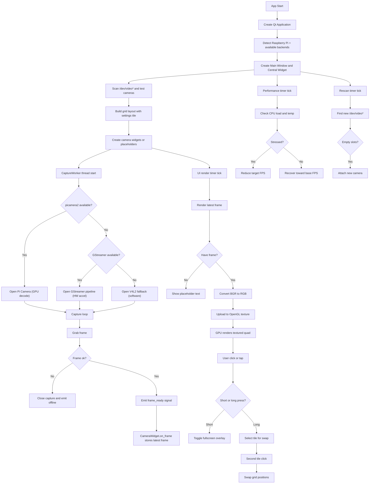

# Camera Grid App — Deep Dive Guide

This README is a **conceptual map** of the codebase. It focuses on the complex parts: **threading, frame flow, GPU-accelerated rendering, hot-plug, dynamic FPS**, and more.



---

## 1) High-level Architecture

The application is split into **three core layers**:

1. **Capture Layer (background threads)**
   - `CaptureWorker(QThread)`
   - Uses **GPU-accelerated backends** when available:
     - `picamera2` for Pi Camera modules (hardware decode)
     - GStreamer pipelines for USB cameras (hardware acceleration)
     - V4L2/OpenCV fallback (software decode)
   - Pulls frames continuously without blocking the UI

2. **Rendering Layer (UI thread, GPU-accelerated)**
   - `CameraWidget` contains a `GLVideoWidget` (OpenGL)
   - Frames are uploaded as GPU textures
   - Scaling/display happens entirely on the GPU
   - A `QTimer` controls how often the UI updates (UI FPS)

3. **Orchestration Layer (main app)**
   - `main()` builds the grid, manages discovery and hot-plugging
   - Dynamic FPS tuning is managed by periodic checks
   - Raspberry Pi detection for optimized profiles

---

## 2) Frame Lifecycle (Capture → GPU → Display)

**Frames are captured in a background thread**, processed minimally, then rendered via GPU:

```
CaptureWorker.run()
  -> picamera2.capture_array()     # GPU decode (Pi Camera)
  -> OR GStreamer pipeline         # HW accelerated (USB)
  -> OR grab()/retrieve()          # Software fallback
  -> emit frame_ready(frame)

CameraWidget.on_frame(frame)
  -> store as _latest_frame

CameraWidget._render_latest_frame()
  -> cv2.cvtColor(BGR -> RGB)
  -> GLVideoWidget.update_frame()
     -> glTexImage2D()             # Upload to GPU texture
     -> glBegin(GL_QUADS)          # Draw textured quad
     -> GPU handles scaling        # No CPU scaling!
```

### Why GPU rendering matters

| Old (CPU) | New (GPU) |
|-----------|-----------|
| `QImage` conversion | Direct texture upload |
| `QPixmap.scaled(SmoothTransformation)` | OpenGL quad scaling |
| CPU bottleneck on Pi | GPU does the heavy lifting |

---

## 3) Capture Backend Priority

The capture worker tries backends in this order:

```
1. picamera2 (Pi Camera modules)
   └── Uses Raspberry Pi GPU for H.264 decode
   └── Lowest CPU usage

2. GStreamer pipeline (USB cameras on Pi)
   └── v4l2src ! videoconvert ! appsink
   └── Can leverage hardware acceleration

3. V4L2 + OpenCV (fallback)
   └── Software decode
   └── Works everywhere but uses more CPU
```

### Backend selection logic

```python
if use_picamera2 and PICAMERA2_AVAILABLE:
    # Try Pi Camera first
    self._try_open_picamera2()
elif use_gstreamer:
    # Try hardware-accelerated pipeline
    cv2.VideoCapture(pipeline, cv2.CAP_GSTREAMER)
else:
    # Software fallback
    cv2.VideoCapture(index, cv2.CAP_V4L2)
```

---

## 4) Threading Model (Critical Concept)

### CaptureWorker (QThread)
- Runs in its own thread
- Keeps the camera alive
- Emits frames safely using Qt signals
- On Pi: runs with `os.nice(5)` to prioritize UI

### UI Thread
- Receives signals via `pyqtSignal`
- Renders frames on a timer via OpenGL
- GPU texture upload is fast and non-blocking

**Key rule:** UI updates must happen on the UI thread.  
Qt's signal-slot system ensures thread-safe transfers.

---

## 5) OpenGL Rendering Pipeline

The `GLVideoWidget` handles GPU-accelerated display:

```python
initializeGL()
  -> glGenTextures()           # Create texture handle
  -> glTexParameteri()         # Set filtering (GL_LINEAR)

update_frame(frame_bgr)
  -> cv2.cvtColor(BGR -> RGB)  # Only CPU work
  -> Store as bytes

paintGL()
  -> glTexImage2D()            # Upload frame to GPU
  -> Calculate aspect ratio
  -> glBegin(GL_QUADS)         # Draw textured quad
  -> GPU scales to fit widget  # FREE scaling!
```

### Why this is fast
- **No CPU scaling** — GPU handles resize
- **No QImage/QPixmap conversion** — direct texture upload
- **Aspect ratio preserved** — calculated once per frame

---

## 6) FPS Control (Two Layers)

There are **two FPS values**:

| Type | Purpose | Default (Pi) |
|------|---------|--------------|
| Capture FPS | How fast the camera captures frames | 10-20 |
| UI FPS | How fast frames are rendered | 10-15 |

This lets you capture at a reasonable FPS but render slower to reduce load.

### Pi-optimized profiles

```python
def choose_profile(camera_count):
    if IS_RASPBERRY_PI:
        if camera_count >= 3:
            return 320, 240, 10, 10   # Aggressive
        elif camera_count == 2:
            return 480, 360, 15, 15
        else:
            return 640, 480, 20, 15
```

---

## 7) Dynamic Performance Tuning

The system monitors:

- **CPU load average** (threshold: 75% on Pi)
- **CPU temperature** (threshold: 70°C on Pi)

When stressed:
- FPS is reduced gradually (`-2` per interval)
- Minimum floor: **5 FPS**

When stable:
- FPS is restored gradually (`+2` per interval)

### Tuning constants

```python
DYNAMIC_FPS_ENABLED = True
PERF_CHECK_INTERVAL_MS = 2000
MIN_DYNAMIC_FPS = 5           # Lower floor for Pi
CPU_LOAD_THRESHOLD = 0.75     # More aggressive
CPU_TEMP_THRESHOLD_C = 70.0   # Pi throttles at 80-85
STRESS_HOLD_COUNT = 2
RECOVER_HOLD_COUNT = 3
```

---

## 8) Swap + Fullscreen UI Behavior

### Short click
- Toggle fullscreen (uses separate `FullscreenOverlay` with its own `GLVideoWidget`)

### Long press (>= 400ms)
- Enter swap mode (yellow border)

### Second click
- Swap two tiles in the grid

All of this logic is contained in:
- `CameraWidget._handle_release_as_left_click()`

---

## 9) Hot-plugging / Device Rescan

When there are placeholders:
- The app rescans `/dev/video*` every **10 seconds** (less frequent on Pi)
- New cameras are attached to empty slots
- Failed devices are throttled by a 30-second cooldown timer

```python
RESCAN_INTERVAL_MS = 10000
FAILED_CAMERA_COOLDOWN_SEC = 30.0
```

---

## 10) Raspberry Pi Detection

The app auto-detects Pi hardware:

```python
def is_raspberry_pi():
    with open('/proc/cpuinfo', 'r') as f:
        cpuinfo = f.read()
    return 'Raspberry Pi' in cpuinfo or 'BCM' in cpuinfo
```

When running on Pi:
- Enables `picamera2` for Pi Camera modules
- Enables GStreamer pipelines for USB cameras
- Uses lower resolution/FPS profiles
- Lowers thermal threshold to 70°C
- Reduces rescan frequency

---

## 11) Dependencies

### Raspberry Pi OS (apt)
```bash
sudo apt install python3-pyqt6 python3-opencv python3-opengl python3-numpy
sudo apt install gstreamer1.0-tools gstreamer1.0-plugins-good gstreamer1.0-plugins-bad
sudo apt install python3-picamera2  # Pre-installed on Bookworm+
```

### Arch Linux ARM (pacman)
```bash
sudo pacman -S python-pyqt6 python-opencv python-pyopengl python-numpy
sudo pacman -S gstreamer gst-plugins-base gst-plugins-good gst-plugins-bad
yay -S python-picamera2  # From AUR
```

---

## 12) Self Reminder

- **Never block the UI thread** with I/O or camera calls.
- Use Qt signals for thread-safe communication.
- Keep the capture loop minimal to avoid frame lag.
- **Use GPU for rendering** — avoid CPU-based scaling.
- Any new UI features should be isolated inside `CameraWidget`.
- Test on actual Pi hardware — emulators don't reflect real performance.

---

## 13) Performance Comparison

| Metric | Old (CPU) | New (GPU) |
|--------|-----------|-----------|
| 3 cameras @ 640×480 | ~10 FPS, high CPU | ~20 FPS, low CPU |
| Scaling method | `QPixmap.scaled()` | OpenGL texture |
| Decode (Pi Camera) | Software (OpenCV) | Hardware (picamera2) |
| Decode (USB) | Software (V4L2) | GStreamer (HW path) |
| Thermal throttling | Frequent | Rare |
| CPU usage (3 cams) | 80-100% | 40-60% |