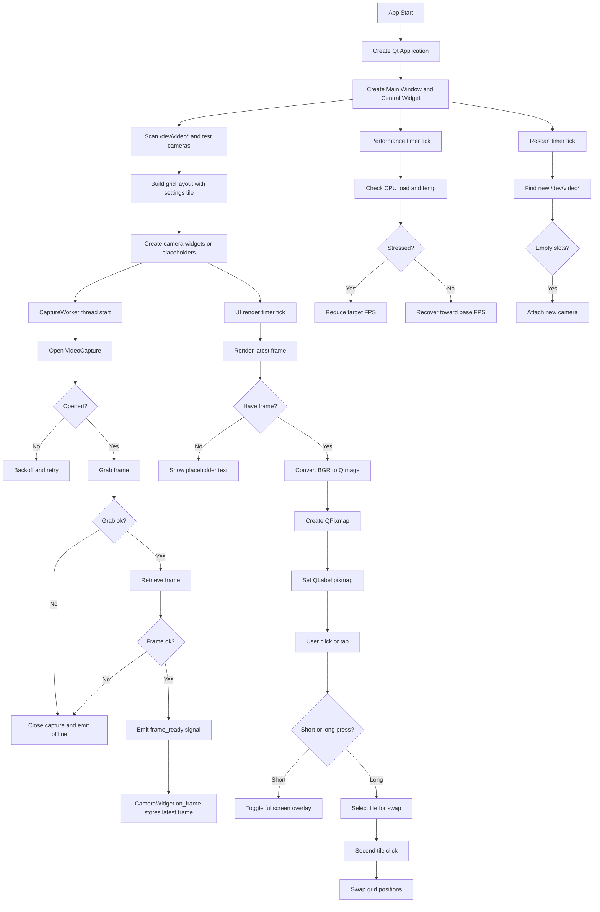

# Project Architecture Overview



## 1) High-level Architecture

The application is split into **three core layers**:

1. **Capture Layer (background threads)**
   - `CaptureWorker(QThread)`
   - Talks to OpenCV (`cv2.VideoCapture`)
   - Pulls frames continuously without blocking the UI

2. **Rendering Layer (UI thread)**
   - `CameraWidget` renders latest frame in a `QLabel`
   - A `QTimer` controls how often the UI updates (UI FPS)

3. **Orchestration Layer (main app)**
   - `main()` builds the grid, manages discovery and hot-plugging
   - Dynamic FPS tuning is managed by periodic checks

---

## 2) Frame Lifecycle (Capture → UI)

**Frames are captured in a background thread**, then passed into the UI:

```
CaptureWorker.run()
  -> grab() / retrieve() frame
  -> emit frame_ready(frame)
CameraWidget.on_frame(frame)
  -> store as _latest_frame
CameraWidget._render_latest_frame()
  -> QImage -> QPixmap -> QLabel
```

### Why this is important
- Capturing frames in the UI thread would freeze the interface.
- Storing only the **latest frame** prevents backlog and latency.

---

## 3) Threading Model (Critical Concept)

### CaptureWorker (QThread)
- Runs in its own thread
- Keeps the camera alive
- Emits frames safely using Qt signals

### UI Thread
- Receives signals via `pyqtSignal`
- Renders frames on a timer

**Key rule:** UI updates must happen on the UI thread.
Qt’s signal-slot system ensures thread-safe transfers.

---

## 4) FPS Control (Two Layers)

There are **two FPS values**:

| Type | Purpose |
|------|---------|
| Capture FPS | How fast the camera captures frames |
| UI FPS | How fast frames are rendered |

This lets you capture at high FPS but render slower to reduce UI load.

**Dynamic FPS tuning** can reduce Capture FPS when system load is high.

---

## 5) Dynamic Performance Tuning

The system monitors:

- CPU load average
- CPU temperature

When stressed:
- FPS is reduced gradually (`-2`)
When stable:
- FPS is restored gradually (`+2`)

This is controlled by:
- `DYNAMIC_FPS_ENABLED`
- `PERF_CHECK_INTERVAL_MS`
- `STRESS_HOLD_COUNT` / `RECOVER_HOLD_COUNT`

---

## 6) Swap + Fullscreen UI Behavior

### Short click
- Toggle fullscreen

### Long press (>= 400ms)
- Enter swap mode (yellow border)

### Second click
- Swap two tiles

All of this logic is contained in:
- `CameraWidget._handle_release_as_left_click()`

---

## 7) Hot-plugging / Device Rescan

When there are placeholders:
- The app rescans `/dev/video*` every 5 seconds
- New cameras are attached to empty slots
- Failed devices are throttled by a cooldown timer

---

## 8) Self Reminder

- **Never block the UI thread** with I/O or camera calls.
- Use Qt signals for thread-safe communication.
- Keep the capture loop minimal to avoid frame lag.
- Any new UI features should be isolated inside `CameraWidget`.

---
